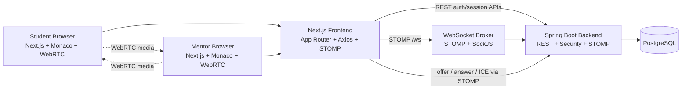

# Architecture Diagram

## Layering

- Frontend: route-level pages, room components, auth provider, realtime hooks, WebRTC hook
- Backend: controller -> service -> repository -> entity
- Realtime: STOMP destinations for chat, code sync, and signaling
- Persistence: users, sessions, messages, code snapshots

## Runtime Boundaries

- REST is used for auth, session lifecycle, history fetch, and recovery after refresh
- WebSocket/STOMP is used for low-latency room collaboration
- WebRTC transports media peer-to-peer; Spring Boot acts only as the signaling layer
