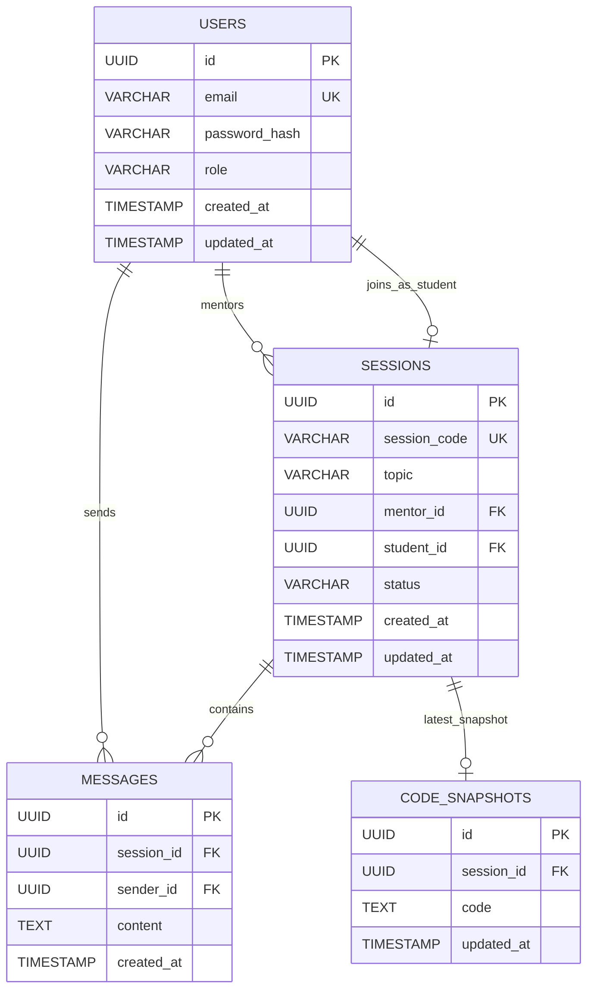

# ER Diagram

## Notes

- A session always has one mentor.
- A session may have zero or one student until joined.
- Chat messages are persisted in chronological order per session.
- Code snapshots are stored as the latest known editor state for recovery after refresh/reconnect.
